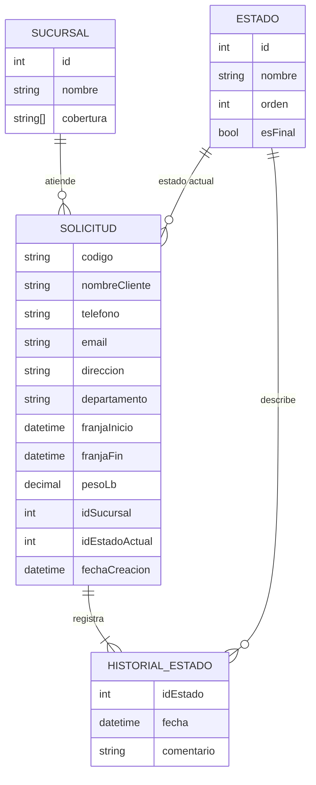

# Prueba para puesto de desarrollador en CAEX
## Recolecciones Cargo Expreso

Portal de autoservicio para solicitar la recolección de un paquete a domicilio u oficina y consultar su estado con un código de solicitud. Incluye API REST protegida con API Key, frontend responsivo con línea de tiempo horizontal, documentación Swagger y Dockerfile.

## Stack

| Capa | Tecnología |
|---|---|
| Backend | Node.js + Express |
| Datos | Archivo JSON (`src/data/db.json`) con 5 solicitudes precargadas |
| Frontend | HTML, CSS y JavaScript sin frameworks, servido por el mismo Express |
| Documentación | OpenAPI 3 + Swagger UI en `/api-docs` |
| Despliegue | Docker |

## Estructura

```
src/
├── server.js                 # arranque del servidor
├── app.js                    # configuración de Express, Swagger y rutas
├── config.js                 # puerto, API key y ruta de datos (variables de entorno)
├── errors.js                 # error de negocio con código HTTP
├── routes/                   # definición de endpoints
├── controllers/              # capa HTTP (request/response)
├── services/                 # reglas de negocio
├── repositories/             # acceso a datos (JSON)
├── middleware/               # validación de x-api-key y manejo global de errores
├── notifications/            # notificación simulada de email/SMS
└── data/db.json              # datos semilla
public/                       # frontend
docs/openapi.yaml             # especificación de la API
```

La separación en capas (rutas → controlador → servicio → repositorio) permite cambiar el almacenamiento a SQL Server o MySQL reemplazando solo el repositorio, sin tocar reglas de negocio ni controladores.

## Cómo ejecutar

### Opción 1: Node.js (18 o superior)

```bash
npm install
npm start
```

### Opción 2: Docker

```bash
docker build -t recolecciones-caex .
docker run -p 3000:3000 recolecciones-caex
```

Luego abrir:

| Recurso | URL |
|---|---|
| Frontend | http://localhost:3000 |
| Swagger | http://localhost:3000/api-docs |

Variables de entorno opcionales: `PORT` (default 3000) y `API_KEY` (default `caex-demo-key-2026`).

## Seguridad

Todos los endpoints bajo `/api/recolecciones` requieren el header:

```
x-api-key: caex-demo-key-2026
```

Sin la key o con una key incorrecta se responde `401`.

## Endpoints

| Método | Ruta | Descripción | Respuestas |
|---|---|---|---|
| POST | `/api/recolecciones` | Registra una solicitud y retorna su código único | 201, 400, 401 |
| GET | `/api/recolecciones/{codigo}` | Consulta estado, sucursal asignada e historial | 200, 404, 401 |
| PATCH | `/api/recolecciones/{codigo}/estado` | Cambia el estado y dispara la notificación simulada | 200, 400, 404, 401 |

El enunciado pide notificar al cambiar de estado pero no define cómo se cambia, por eso se agregó el endpoint PATCH.

### Ejemplos con curl

Crear solicitud:

```bash
curl -X POST http://localhost:3000/api/recolecciones \
  -H "Content-Type: application/json" \
  -H "x-api-key: caex-demo-key-2026" \
  -d '{
    "nombreCliente": "Carlos Méndez",
    "telefono": "55559999",
    "email": "carlos@correo.com",
    "direccion": "6a avenida 8-10 zona 10, Guatemala",
    "departamento": "Guatemala",
    "franjaInicio": "2026-12-15T15:00:00.000Z",
    "franjaFin": "2026-12-15T17:00:00.000Z",
    "pesoLb": 8
  }'
```

Consultar solicitud:

```bash
curl http://localhost:3000/api/recolecciones/REC-20260925-C3D4 \
  -H "x-api-key: caex-demo-key-2026"
```

Cambiar estado:

```bash
curl -X PATCH http://localhost:3000/api/recolecciones/REC-20260926-E5F6/estado \
  -H "Content-Type: application/json" \
  -H "x-api-key: caex-demo-key-2026" \
  -d '{ "estado": "Recolector en Camino", "comentario": "Recolector asignado" }'
```

### Códigos de prueba precargados

| Código | Estado | Sucursal/Hub |
|---|---|---|
| REC-20260920-A1B2 | Recolectado | Sucursal Central Mixco |
| REC-20260925-C3D4 | Recolector en Camino | Hub Quetzaltenango |
| REC-20260926-E5F6 | Pendiente de Asignación | Hub Zacapa |
| REC-20260927-G7H8 | Cancelada | Hub Cobán |
| REC-20260928-J9K0 | Pendiente de Asignación | Hub Escuintla |

## Reglas de negocio

| Regla | Comportamiento |
|---|---|
| Código inexistente | 404 con mensaje amigable |
| Franja horaria en el pasado | 400 |
| Hora de fin menor o igual a la de inicio | 400 |
| Campos obligatorios: nombre, teléfono (8 dígitos), dirección, departamento, franja y peso | 400 con el detalle de cada error (también validado en el frontend) |
| Peso no numérico o menor o igual a 0 | 400 |
| Asignación de sucursal | Según el departamento de la dirección; si no hay cobertura se asigna Sucursal Central Mixco |
| Código único | Formato `REC-AAAAMMDD-XXXX`, verificado contra los existentes |
| Transiciones permitidas | Pendiente de Asignación → Recolector en Camino → Recolectado; cualquier estado no final → Cancelada |
| Notificación | Cada registro y cambio de estado escribe en consola un email/SMS simulado según los datos de contacto |

## Estructura de datos



## Decisiones y limitaciones conocidas

- La API Key está visible en el JavaScript del frontend porque es una demo. En producción se usaría un backend-for-frontend o autenticación de usuarios para no exponerla.
- El almacenamiento en JSON es suficiente para la prueba, pero no maneja concurrencia; en producción se usaría SQL Server con el mismo modelo de datos.
- El peso se maneja en libras (`pesoLb`), la unidad de uso común en Guatemala; el enunciado no especificaba unidad.
- El nombre y el teléfono son obligatorios porque el recolector necesita a quién contactar y la notificación SMS requiere un número. El correo es opcional.
- Las fechas se guardan en UTC (ISO 8601) y el frontend las muestra en la zona horaria local del navegador.

## Uso de IA

Se utilizó **Claude (Anthropic)** como asistente durante el desarrollo, para:

- Analizar el enunciado e identificar supuestos no definidos (cómo se cambia el estado, cómo se asigna la sucursal, cómo modelar la franja horaria).
- Proponer la arquitectura por capas y el modelo de datos.
- Generar la base del código de backend, frontend, Swagger y Dockerfile.

Se eligió porque permitía cumplir el alcance completo en el tiempo disponible. Todo el código fue revisado, ejecutado y probado manualmente (casos 200, 201, 400, 401 y 404, cambio de estado y vista móvil).
